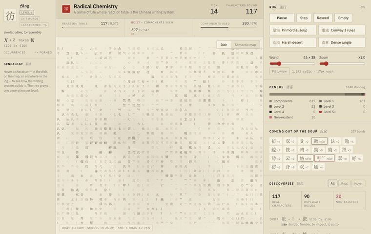

# Radical Chemistry

**Live: https://hanzi.thomascdnns.com**

A Game of Life whose reaction table is the Chinese writing system. Components
drift across a grid, bond into real characters when the script says they
combine that way, are born and die by Conway's neighbour counts, break apart
under crowding, and starve when they cannot make meaning.

    氵 + 木 → 沐    十 + 八 → 木    木 + 木 → 林    日 + 月 → 明

No combination rule is hand-written. All **8,572 reactions** are derived from
[makemeahanzi](https://github.com/skishore/makemeahanzi) ideographic
description sequences, weighted by
[CC-CEDICT](https://www.mdbg.net/chinese/dictionary?page=cc-cedict) frequency.
A character's *level* is the depth of its decomposition tree, so `林` is one
generation up from `木`, and runs reach level 6.

Level is drawn as **ink density** the way a brush painting grades a wash, from
a pale component to near-black, with cinnabar kept for the deepest characters
and for the marks a reader makes. Light is xuan paper; dark is a stone rubbing,
pale strokes on an inked ground.

The **semantic map** places all 9,142 characters by meaning — tf-idf over their
English glosses, SVD, then t-SNE. It recovers the semantic radical families on
its own: the regions it names include water, meat, tree, bird, silk and horse.

## Run it

    open radical-chemistry.html          # self-contained, no server needed

    data/fetch_data.sh                   # the two dictionaries
    python3 data/build_data.py           # -> data/hanzi.json (the reaction table)
    python3 data/build_semantics.py      # -> adds map coordinates (numpy, sklearn)
    python3 data/export_data.py          # -> data/world.tsv for the native engine

    npm install
    npm run wasm                         # backend/sim.rs -> backend/sim.wasm
    npm run native                       # backend/sim.rs -> backend/sim
    npm run build                        # -> radical-chemistry.html + dist/artifact.html

`backend/sim.rs` is the engine and has two front-ends. The page runs it as
WebAssembly (54 KB, inlined as base64) and falls back to an equivalent
JavaScript implementation where wasm will not instantiate. The colophon says
which is live.

    ./backend/sim --ticks 6000 --cols 180 --rows 113 --recall 32
    python3 backend/sweep.py --ticks 600

## What the parameters do

| | |
| --- | --- |
| **Patience** | Ticks without bonding before starving, times the piece's level. |
| **Crowding limit** | A character this hemmed in breaks back into its two parts. |
| **Birth / isolation / overcrowding** | Conway's layer. A new cell inherits a component from a neighbour, which is what makes discovered characters colonise. |
| **Mobility / component rain** | Drift, and fresh components each tick. |
| **Character rain** | Off by default. Re-seeds characters already discovered. |

## How much of the writing system it finds

Up to **98.5% of the 8,572 producible characters**. The governing variable is
not grid size or run length but **how full the dish is** — at 99% occupancy
nothing can move and coverage stalls near 80%. Leave overcrowding death on at 7
and the population settles near 74% fill, which is loose enough to keep mixing:

    ./sim --ticks 60000 --cols 180 --rows 113 --density 0.7 --starve 24 \
          --pressure 5 --mobility 1.0 --mutation 0 --rain 16 --recall 40 \
          --birth 4 --lonely 0 --crowd 7

Character rain is what makes it possible; without it deep characters die faster
than they can be rebuilt and the curve is flat by tick 1500.

## Layout

    frontend/          the page
      index.html         the shell: mount points, nothing else
      src/styles.css     tokens and layout
      src/store.js       what the panel draws, as signals
      src/ui/Panel.jsx   the panel, as Preact components
      src/sim.js         simulation, canvas renderers, input

    backend/           the engine
      sim.rs             one implementation, native and wasm front-ends
      sweep.py           parameter sweeps, driving the native binary

    data/              the pipeline and what it derives
      fetch_data.sh      the two open dictionaries
      build_data.py      -> hanzi.json, the reaction table
      build_semantics.py -> semantic map coordinates
      export_data.py     -> world.tsv, for the native engine

    scripts/package.js   Vite output -> standalone page + artifact fragment

Vite bundles the frontend to one self-contained file, inlining the reaction
table and the wasm, because the page has to work opened off disk and inside a
sandbox that blocks external requests. Preact renders the panel; the canvas
loop and the engine stay imperative, since a virtual DOM buys them nothing.
